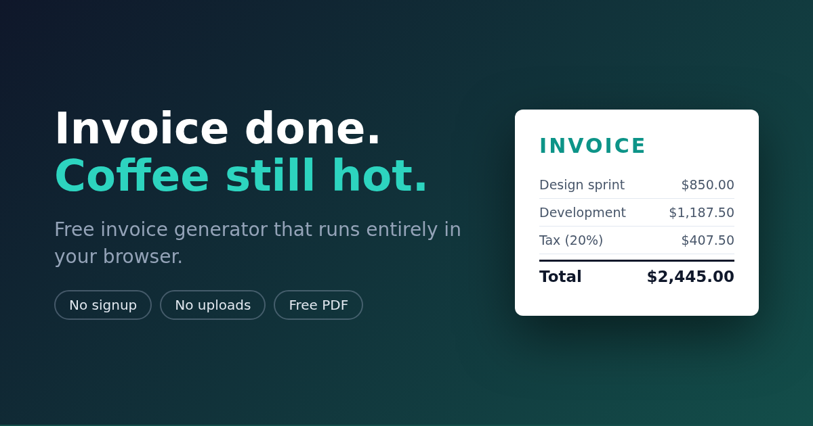

# Billotter

**Free invoice generator that runs entirely in your browser.** No signup, no uploads, no backend — your invoice data never leaves your device.

**Live app → https://billotter.com/**



## Why it exists

Every "free" invoice tool wants a signup, a trial, or your clients' data on their servers. Billotter is a single static page: fill it in, hit Download PDF, get paid. Open your browser's network tab and watch nothing happen — the privacy claim is the architecture, not a policy.

## Features (free, no limits)

- Invoices, **estimates, quotes and receipts** — one click to switch
- Line items with autogrow descriptions, tax, discount, partial payments & balance due
- Automatic **PAID stamp** on settled invoices
- **26 currencies** with correct locale formatting (`Intl.NumberFormat`)
- Your logo, smart invoice numbering, PDF named after the document ("INV-0007 — Acme Co")
- Local autosave + a sidebar of all your invoices; JSON backup export/import
- **16 niche templates** with pre-filled line items — [photography](https://billotter.com/templates/photography/), [plumbing](https://billotter.com/templates/plumbing/), [consulting](https://billotter.com/templates/consulting/), [auto repair](https://billotter.com/templates/auto-repair/) and [a dozen more](https://billotter.com/templates/)
- Zero third-party requests: fonts self-hosted, no CDN, no analytics, no cookies

## Pro ($9 once, lifetime)

Client book (save clients, one-click refill) · item library (your services & rates) · **pay-by-QR** (your PayPal/Venmo link as a scannable code on every PDF) · premium themes · custom accent color · no credit line on PDFs.

## Development

It's a static site — no build step. Serve the folder and open it:

```bash
python3 -m http.server 8000
```

## Tech

Vanilla JS, one HTML file per page, `localStorage` for persistence, print CSS for the PDF, [qrcode-generator](https://github.com/kazuhikoarase/qrcode-generator) (MIT, vendored) for pay-by-QR. No framework, no server.

## License

The code is source-available for transparency. All rights reserved.

---

Made for freelancers who'd rather be working. → **https://billotter.com/**
